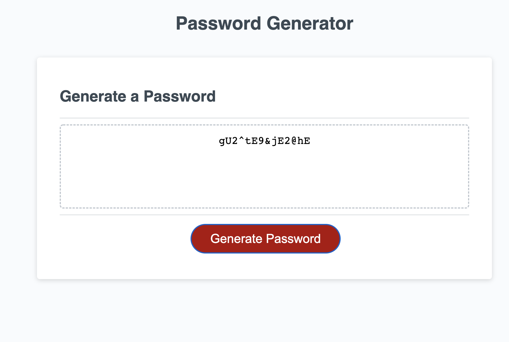

# Password Generator Starter Code
This is a simple javascript powered password generator. It contains below workflow.

* User get to select length of the password.
It should be of length between 8 and 128 characters.
* User get to select atlease one type of character set from lowercase, uppercase & special characters.
* User get to select to include numbers in password or not.

## Technologies used:
#### HTML, CSS, Java script

## Application Screenshots
### Selecting atleast one character type error

### Selecting password length between 8 and 128 error

### Selecting lowercase characters prompt

### selecting password lenght 

### Successful generated Password

#### developed by Ramu Makkena